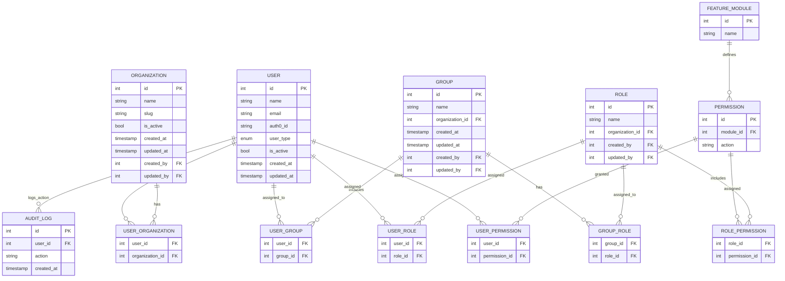

```mermaid
erDiagram

    USER {
        int id PK
        string name
        string email
        string auth0_id
        enum user_type
        bool is_active
        timestamp created_at
        timestamp updated_at
    }

    ORGANIZATION {
        int id PK
        string name
        string slug
        bool is_active
        timestamp created_at
        timestamp updated_at
        int created_by FK
        int updated_by FK
    }

    USER_ORGANIZATION {
        int user_id FK
        int organization_id FK
    }

    GROUP {
        int id PK
        string name
        int organization_id FK
        timestamp created_at
        timestamp updated_at
        int created_by FK
        int updated_by FK
    }

    USER_GROUP {
        int user_id FK
        int group_id FK
    }

    ROLE {
        int id PK
        string name
        int organization_id FK
        int created_by FK
        int updated_by FK
    }

    GROUP_ROLE {
        int group_id FK
        int role_id FK
    }

    USER_ROLE {
        int user_id FK
        int role_id FK
    }

    FEATURE_MODULE {
        int id PK
        string name
    }

    PERMISSION {
        int id PK
        int module_id FK
        string action
    }

    ROLE_PERMISSION {
        int role_id FK
        int permission_id FK
    }

    USER_PERMISSION {
        int user_id FK
        int permission_id FK
    }

    AUDIT_LOG {
        int id PK
        int user_id FK
        string action
        timestamp created_at
    }

    %% Relationships
    USER ||--o{ USER_ORGANIZATION : belongs_to
    ORGANIZATION ||--o{ USER_ORGANIZATION : has

    USER ||--o{ USER_GROUP : assigned_to
    GROUP ||--o{ USER_GROUP : includes

    GROUP ||--o{ GROUP_ROLE : has
    ROLE ||--o{ GROUP_ROLE : assigned_to

    USER ||--o{ USER_ROLE : assigned
    ROLE ||--o{ USER_ROLE : assigned

    FEATURE_MODULE ||--o{ PERMISSION : defines
    PERMISSION ||--o{ ROLE_PERMISSION : assigned
    ROLE ||--o{ ROLE_PERMISSION : includes

    USER ||--o{ USER_PERMISSION : assigned
    PERMISSION ||--o{ USER_PERMISSION : granted

    USER ||--o{ AUDIT_LOG : logs_action
```